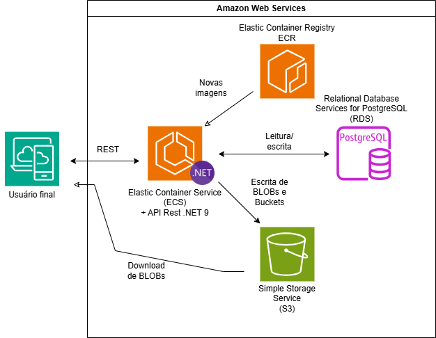

# Prova Prática

---

## ⚙️ Tecnologias

- ASP.NET 9
- Libs comuns (+ Scalar, FluentValidation, FluentResults, Mediator.SourceGeneration, AWS SDK for .NET, xUnit, NSubstitute)
- EF Core (+ Npgsql)
- PostgreSQL
- MinIO (para simulação de AWS S3)
- AWS S3
- ECS + ECR
- Docker + Docker Compose (para subir app e banco)

## 🧪 Testes

Os testes de unidade cobrem a regra de negócio da criação e edição de produtos.   
Utilizei xUnit + NSubstitute.   
Para executar-los: `dotnet test ./tests/Application.Test/Application.Test.csproj`


## 🚀 Execução

Siga os passos abaixo para clonar e executar este projeto em sua máquina local:

### 1. Clone o Repositório

```bash
git clone https://github.com/Adeilton-Ro/prova-pratica.git
```

### 2. Acesse o Diretório do Projeto
```bash
cd prova-pratica
```

### 3. Configure as Variáveis de Ambiente

Edite as variáveis de ambiente presentes no inicio do arquivo: `docker-compose.yaml`

### 4. Execute o Docker Compose

Certifique-se de que o Docker esteja instalado e rodando em sua máquina. Em seguida, execute:

```bash
docker-compose up --build
```

> ⚠ *Observação:* O Docker precisa estar rodando antes de executar este comando.

Scalar documentando o consumo REST estará disponível em: http://localhost:8080/scalar

## 🌐Topologia da infraestrutura

A topologia do sistema é composta por três containers principais:

- **API REST** (.NET 9), no ambiente produtivo é executada num Elastic Container Service (ECS), e imagem versionada no Elastic Container Registry (ECR)
- **Banco de Dados relacional (PostgreSQL)**, no ambiente produtivo executado como uma instancia de Amazon Relational Database Service for PostgreSQL (RDS)
- **Serviço de Armazenamento de BLOBs (MinIO)**, no ambiente produtivo executado como uma instancia do Simple Storage Service (S3)



Todos os serviços podem ser executados localmente via `docker-compose`, descrita melhor na secção Executando o projeto...

## 🧱 Arquitetura

Este projeto está estruturado segundo os princípios da Clean Architecture, organizando responsabilidades em camadas separadas:

- **Domain**: núcleo da aplicação
- **Application**: casos de uso
- **Infrastructure**: detalhes de implementação/integração
- **Presentation**: interface externa (API REST)

A estrutura de pastas do repositório e a descrição das responsabilidades pode ser encontrada na proxima secção.

## 🗂️ Estrutura de Pastas
Abaixo está a estrutura de arquivos, com a descrição das responsabilidades de cada pasta:

```md
├─ .github: Actions do github
│  └─ workflows
│     └─ main.yml
├─ ...: Dockerfile, compose, README, etc..
├─ src 
│  ├─ Application: Responsável por descrever o comportamento da aplicação
│  │  ├─ Behaviours: Declara comportamentos transversais entre casos de uso
│  │  │  └─ ...
│  │  ├─ ...: Arquivos auxiliares do projeto (.csproj, DependencyInjection, modelos de erro em comum, etc.)
│  │  └─ UseCases: Declara todos casos de uso, suas entradas, logica e respostas
│  │     └─ ...
│  ├─ Domain: Responsável por modelar as entidades do projeto e descrever o comportamento de repositorios e serviços relacionados
│  │  └─ ...
│  ├─ Infrastructure: Responsável por integrar com a infraestrutura necessaria para executar os casos de uso, como banco de dados e S3
│  │  ├─ Database
│  │  │  ├─ ProvaPraticaDbContext.cs: Contexto transacional para acessar o banco de dados
│  │  │  └─ Repositories: Declara repositorios de acesso ao banco de dados
│  │  │     └─ ...
│  │  ├─ ...: Arquivos auxiliares do projeto (.csproj, DependencyInjection, etc.)
│  │  └─ S3
│  │     └─ ImageStorageServices.cs: Integra com SDK do S3 para armazenar imagens
│  └─ Presentation: Responsável por expor os endpoints HTTP da aplicação (API REST)
│     ├─ DependencyInjection.cs: Agrega toda a injeção de dependência do projeto
│     ├─ Endpoints: Declara, mapeia e documenta endpoints
│     │  └─ ...
│     ├─ Program.cs: Ponto de entrada do programa
│     ├─ ...: Arquivos auxiliares do projeto (.csproj, ResultSerializer, etc.)
│     └─ appsettings.json: JSON com configuracoes de cada ambiente
│        └─ ...
└─ tests: Projetos de testes
   └─ Application.Test: Cobre a camada de Application, segue a mesma estrutura do projeto testado
      ├─ ...: Arquivos auxiliares do projeto (.csproj, etc.)
      ├─ Behaviours
      │  └─ ...
      └─ UseCases
         └─ ...
```
